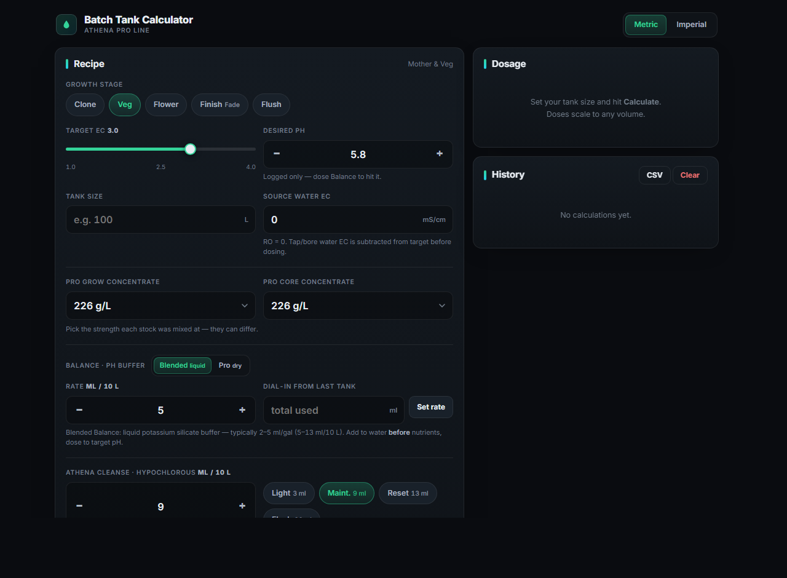
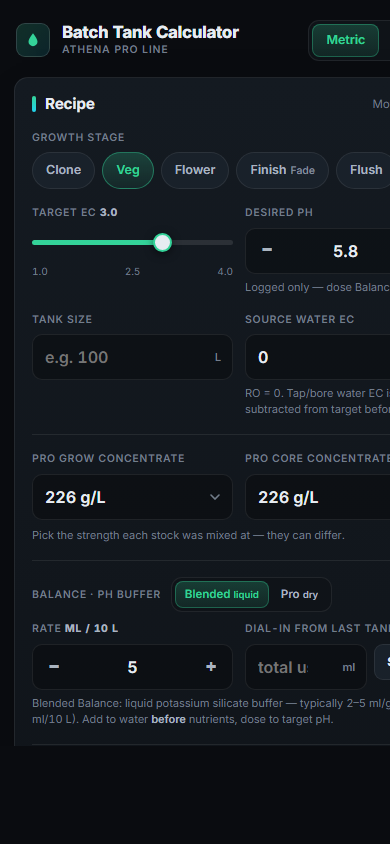

# Athena Batch Tank Calculator — Pro Line

**🚀 [Use the live calculator](https://jaketherabbit.github.io/Athena-Batch-Tank-Nutrient-Calculator/)** · also at [athena.legacy.ag](https://athena.legacy.ag)

A precision dosing calculator for mixing [Athena Pro Line](https://support.athenaag.com/hc/en-us/articles/17190427112859-Pro-Line-Feed-Schedules) nutrients into batch tanks of any size. Feed charts give you per-gallon ratios; this scales the official dosing chart to your exact reservoir — 17 gallons or 2,500 liters — with no manual math.

| Desktop | Mobile |
|---|---|
|  |  |

**Disclaimer:** Independent tool — not affiliated with, endorsed, or sponsored by Athena. Verify all calculations. Use at your own risk.

## Features

- **Official Athena dosing chart, interpolated** — the chart anchors at EC 1.0 / 1.5 / 2.0 … 4.0; the calculator linearly interpolates between anchors so EC 2.7 gives a real dose instead of silently snapping to 2.5.
- **Metric & Imperial** — liters/gallons toggle. All rates are stored canonically (liters, ml/10 L) and converted only for display, so switching units never changes the actual dose.
- **Growth-stage presets** — Clone / Veg / Flower / Finish / Flush chips set pH, EC, Balance and Cleanse rates. Finish swaps Core → Fade, Flower swaps Grow → Bloom, Flush is RO + Cleanse only.
- **Pro Balance & Blended Balance** — choose your pH buffer:
  - *Blended Balance* (liquid potassium silicate) — ml dosing, label range 2–5 ml/gal.
  - *Pro Balance* (dry potassium carbonate) — dose from a 40–120 g/L stock, with dry-gram equivalents shown.
  - A **dial-in utility** converts "I used 73 ml to pH this tank" into a saved rate for next time. Rates are remembered per product.
- **Athena Cleanse only** — preset chips for Light / Maintenance / Reset / Flush rates (label: 2–5 ml/gal maintenance, 5–10 ml/gal reset & final flush). Anolyte support removed.
- **Source water EC offset** — running tap or bore water? Enter its EC and it's subtracted from the target before dosing (RO = 0).
- **Mixed concentrate strengths** — independent strength selectors for Grow/Bloom and Core/Fade stocks (113 / 226 / 240 / 282 g/L ⇄ 1 / 2 / 2.2 / 2.5 lb/gal), because real stockrooms have mismatched batches. Dry-gram equivalents shown for every dose.
- **Top-up calculator** — tank reads EC 2.4, target is 3.0? Get the exact ml of each part to add. Overshot? Get the liters of water to dilute with.
- **Mix mode** — fullscreen tank-side checklist in the correct order (Cleanse → Balance → Grow/Bloom → Core/Fade) with tap-to-tick steps and big numbers.
- **History + CSV export** — every calculation saved to localStorage, expandable entries, one-tap delete, CSV export. Old-version history is migrated automatically.
- **Share** — native share sheet on mobile, clipboard fallback on desktop.
- **Phone-first** — big touch targets, no-zoom inputs, safe-area aware, works as a home-screen app. Single file, no backend, no accounts, fully offline once saved locally.

## Embedding

The calculator is a single self-contained HTML file designed to drop into any site:

```html
<iframe src="https://jaketherabbit.github.io/Athena-Batch-Tank-Nutrient-Calculator/?embed=1"
        style="width:100%;border:0" id="athena-calc"></iframe>
<script>
  addEventListener('message', e => {
    if (e.data?.type === 'abt-height')
      document.getElementById('athena-calc').style.height = e.data.height + 'px';
  });
</script>
```

`?embed=1` hides the header/footer chrome, and the page posts its height to the parent on every resize for seamless auto-sizing.

## Standalone / offline

No installation, no build. Download [`www/index.html`](www/index.html) and open it in any modern browser — everything runs client-side. On a phone, use the browser's **Add to Home Screen** for an app-like fullscreen experience.

## How it works

1. Pick a **growth stage** — pH, EC, Balance and Cleanse rates pre-fill (everything stays editable).
2. Set **target EC** with the slider and enter your **tank size**.
3. Pick the **concentrate strength** each stock was mixed at — Grow/Bloom and Core/Fade can differ.
4. Choose your **Balance product** and rate (use the dial-in utility to capture your water's real demand).
5. **Calculate** → doses appear with per-10 L (or per-gal) rates and dry-gram equivalents.
6. Hit **Mix mode** at the tank and tick off each addition as you pour.

The dose tables are Athena's published dosing chart, taken verbatim. Doses between chart anchors are linear interpolations; an EC below 1.0 is flagged as extrapolated.

## Development

- `www/index.html` — the app (single file: HTML + CSS + vanilla JS, zero dependencies).
- `docs/index.html` — identical copy served by GitHub Pages. Keep both in sync when editing.

Bug reports and PRs welcome. For major changes, open an issue first.

## License

MIT
